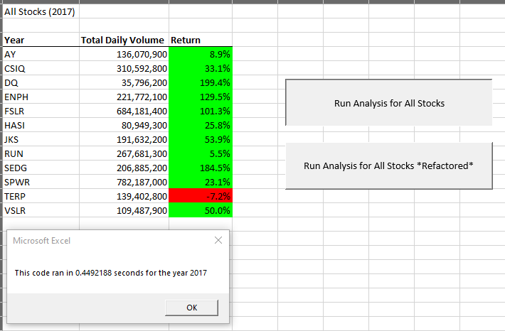

# stock-analysis
Performing analysis on stock data with VBA.

## Overview of Project

In prior module work, we helped Steve analyze a pool of green energy stocks, as well as DAQO which his parents were planning to invest in.  The workbook we prepared for Steve was well-received, where with just the click of a button he could analyze a large pool of data.  Steve would like to do further research and expand the dataset to analyze the stock market performance for both 2017 and 2018.  Although our prior code worked great for 12 stocks, it may not be as efficient when analyzing thousands of stocks.  For this project, we will refactor our VBA code from module 2 to loop through all the data once and collect the exact same information, and from there determine if the refactored code is successful at running quicker compared to the originally written VBA code.

### Elapsed Time for 2017 and 2018 Stock Market Analysis - Original VBA Code  

### Refactored VBA Code

Utilizing the challenge starter code file reference and our knowledge gained throughout module 2 around VBA, we were able to refactor the VBA code to loop through the same dataset, however our new refactored code now runs faster than it did compared to the original VBA code that was written during module 2 work.

    '1a) Create a ticker Index
    ticketIndex = 0

    '1b) Create three output arrays
    Dim tickerVolumes(12) As Long
    Dim tickerStartingPrices(12) As Single
    Dim tickerEndingPrices(12) As Single
    
    ''2a) Create a for loop to initialize the tickerVolumes to zero.
    For i = 0 To 11
    tickerVolumes(i) = 0
    
    Next i
        
    ''2b) Loop over all the rows in the spreadsheet.
    For i = 2 To RowCount
    
        '3a) Increase volume for current ticker
        tickerVolumes(tickerIndex) = tickerVolumes(tickerIndex) + Cells(i, 8).Value
        
        '3b) Check if the current row is the first row with the selected tickerIndex.
        'If  Then
        If Cells(i, 1).Value = tickers(tickerIndex) And Cells(i - 1, 1).Value <> tickers(tickerIndex) Then
        tickerStartingPrices(tickerIndex) = Cells(i, 6).Value
            
            
        End If
        
        '3c) check if the current row is the last row with the selected ticker
         'If the next row’s ticker doesn’t match, increase the tickerIndex.
        'If  Then
        If Cells(i, 1).Value = tickers(tickerIndex) And Cells(i + 1, 1).Value <> tickers(tickerIndex) Then
        tickerEndingPrices(tickerIndex) = Cells(i, 6).Value
       
        End If

            '3d Increase the tickerIndex.
            If Cells(i, 1).Value = tickers(tickerIndex) And Cells(i + 1, 1).Value <> tickers(tickerIndex) Then
            tickerIndex = tickerIndex + 1
            
            End If
    
    Next i
    
    '4) Loop through your arrays to output the Ticker, Total Daily Volume, and Return.
    For i = 0 To 11
        
    Worksheets("All Stocks Analysis").Activate
    Cells(4 + i, 1).Value = tickers(i)
    Cells(4 + i, 2).Value = tickerVolumes(i)
    Cells(4 + i, 3).Value = tickerEndingPrices(i) / tickerStartingPrices(i) - 1
            
    Next i
    
### Elapsed Time for 2017 and 2018 Stock Market Analysis - Refactored VBA Code

       
## Summary 
### Results
Steve can run analysis for all 12 provided stock's total daily volume and return performance, for both calendar year 2017 and 2018, at just the push of a button due to new macros created in VBA.  The macros also tie conditional formatting on stock annual returns for each SCAC to more easily identify which stocks were successful and not successful by year.  Additionally, refactored analysis has sped up the process even more, with new VBA code running the macro even quicker than it did before.  This will help ensure that if Steve expands on his analysis to add more stock data, the refactored code will be able to support the increase in data and run the macro process quicker than before. 

### Advantages of Refactoring Codes
Rafactoring code should overall reduce the run time that it takes to process a macro, which can be advantageous when working with large datasets or if the user plans to add to their current data size.  Refactoring should also ideally run the same macro action, but with less overall steps, which makes it more efficient overall.  By running less steps, your code will also look much cleaner and eaiser to interpret for the developer or any future end-user.

### Disadvantages of Refactoring Code
Refactoring code may be a time-consuming process depending on the length of your code and the budgeted time available to the user.  It is also possible that by refactoring the code, you are also altering the end outcome which is likely disadvantageous to the goal of analyzing your dataset. 

### Advantages of Refactoring Stock Analysis VBA Code
For Steve's stock analysis dataset, refactoring the code led to the macro running the stock analysis in a shorter amount of time, and should also do the same in the instance Steve continues to add to his dataset, compared to the original code.

### Disadvantages of Refactoring Stock Analysis VBA Code
Steve's total dataset was not too large, so in this project the total time saved between running the macro sourced against the original code and the refactored code was very minimal.  Compared against the time it took in total to refactor the code in VBA, there wasn't a high amount of value added here.  That being said, Steve did mention how he plans to analyze larger datasets in the future, which if the amount of data being analyzed was larger, then it may add more value to refactoring the code as the macro run time difference between the original code and refactored code wouldn't be as similar. 
